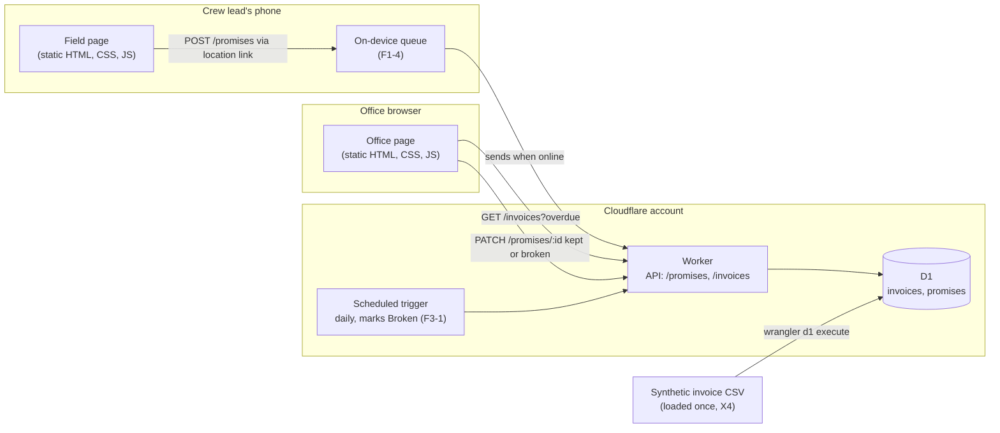

# ARCHITECTURE.md

## The Gate: Build, Buy, or Delegate

Where the Phase 2 system runs and who writes it. Weights were committed before any option was scored.

### Weights

| Criterion | Weight (1 to 5) | Why |
|---|---|---|
| Fits the promise job (J-Jamal, J-Tom) | 5 | A tool that tracks invoices without promises solves the old problem. |
| Team capability | 4 | Three weeks leaves no time to learn a new platform. |
| Switching cost | 4 | Scored from HW4 and HW5, where moving data and redeploying cost each of us an evening. |
| Control of customer data | 5 | Customer names and amounts, even synthetic, are the most sensitive thing in the system. |
| Cost | 3 | Free tiers exist for every option; cost matters only past the course. |

### Scores (1 to 5)

| Criterion | Weight | Build: Worker, D1, static page | Buy: reminder features in off-the-shelf invoicing software | Delegate: bolt.new-generated and hosted app |
|---|---|---|---|---|
| Fits the promise job | 5 | 5 | 2 | 4 |
| Team capability | 4 | 5 | 3 | 2 |
| Switching cost | 4 | 4 | 2 | 2 |
| Control of customer data | 5 | 4 | 2 | 2 |
| Cost | 3 | 5 | 2 | 4 |
| **Weighted total (max 105)** | | **96** | **46** | **58** |

**Notes on the scores.**
- Buy: the products we looked at send reminders about invoices. None records what a customer told someone in the field, which is the whole job. Scored on the nearest fit.
- Delegate: the probe (docs/PROBE-001.md) showed bolt can produce a plausible app from our spec in minutes, and also that it invents a login, a currency picker, and a customer portal. Team capability scores low because none of us could maintain generated code we did not write. Delegation stays available for bounded pieces in Phase 2, each with a DDR.
- Switching cost for Build is 4 because `wrangler d1 export` produced a portable SQL file in HW4, and the Worker is one file.

## ADR-001: Build on Cloudflare Workers and D1

- **Status:** Accepted, 2026-09-28. Driver: Marcus. Approver: Priya.

### Context

Crew leads need to record promises from a phone in the field, and the office needs a list that reflects those promises the next morning. The Gate above favors building on the stack all four members have deployed. Data leaves the browser: each promise (invoice number, promised date, note, location, timestamp) and the synthetic invoice list (customer name, amount, due date, location) are stored in Cloudflare D1 under Cloudflare's free-tier terms, in a region we do not choose. Request metadata, including IP addresses, is logged by Cloudflare by default. Dana is accountable for what crosses as the author of TOOLS.md; the row passes to the Phase 2 Implementer at rotation, with a dated note.

### Options

Build (Worker, D1, static page), Buy (reminder features in invoicing software), Delegate (a bolt.new-generated app). Scored above.

### Decision

Build. One Worker serves the API. D1 holds invoices and promises. Two static pages, a field page and an office page, call the Worker. A daily scheduled trigger on the same Worker marks promises Broken when their date passes (F3-1).

### Consequences

- Easier: every member can read and deploy every part. EVALS.md code evals run against endpoints we already know how to test from HW5.
- Easier: nothing about a promise leaves the Cloudflare account.
- **Harder:** offline logging (F1-4) is on us. Rural properties with poor signal mean the field page has to queue entries on the device, which none of us has built before.
- **Harder:** access without login (F1-5) means a location link is a shared secret. If it leaks, anyone can add promises. Revocation has to work on day one.
- Harder: the owner's weekly summary (F6) competes with core features for three weeks of time.

### Revisit Trigger

Revisit if GreenLine wanted this after the course (real customer data changes the Trust Boundary entirely), or if offline queuing cannot be made reliable by October 15.

## Architecture Diagram

Matches ADR-001 box for box.

