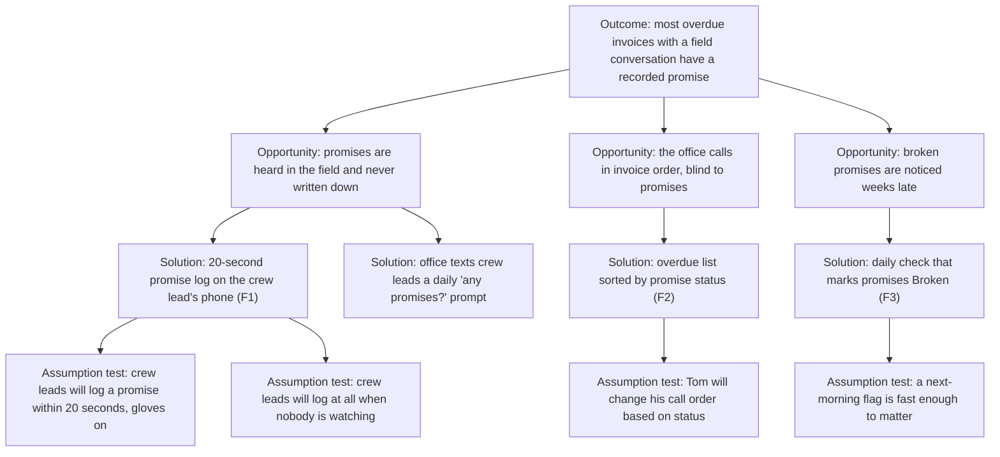

# EVALS.md

Written before any Phase 2 code. The tree says what we are trying to learn, the RAT names the assumption most likely to sink us, and each member's Prediction Stake is committed by its author and never edited.

## Opportunity Solution Tree

S2 was considered and left unbuilt: it moves the memory burden from the crew lead to the office without removing it. It stays on the tree as the fallback if A2 fails.

## Riskiest Assumption (RAT)

**A2 from the tree: crew leads will log a promise when nobody is watching.**

Everything downstream depends on F1 having data. A1 (speed) is testable in a hallway; A2 is about behavior in the field, and every interview with a crew-lead-like user said some version of "that's the office's job." If A2 is false, F2 and F3 are well-built tools over an empty table.

**How Phase 2 tests it.** Five testers (classmates from outside the team, briefed as crew leads) each receive six scripted "customer said" cards over a normal day and a phone with the field page bookmarked. Nobody reminds them. We count promises logged by 8 PM.

**Pass:** at least 18 of 30 promises logged (60 percent). **Fail:** fewer than 12 (40 percent), which sends us to S2. Between the two, we iterate on F1 and retest once.

## Evals Planned for Phase 2

| ID | Type | Checks | Pass condition |
|---|---|---|---|
| E1 | Code | F1-2: POST /promises stores and returns within 2 s | 20 of 20 runs |
| E2 | Code | F1-3: unknown invoice number returns 201 with status Unmatched | Binary |
| E3 | Code | F2-2: overdue list sorts None first, then days overdue | Binary on a 12-row fixture |
| E4 | Code | F3-1: scheduled run marks past-date promises Broken | Binary on a fixture with 3 past, 3 future |
| E5 | Judgment | A1: median time to log a promise, gloves on, 5 testers | Median 20 s or less |
| E6 | Judgment | A2: the RAT test above | 18 of 30 logged |
| E7 | Judgment | A3: shown the list, does Tom's stand-in call a None invoice first? | 4 of 5 testers |

## Prediction Stakes

Each member predicted the RAT result (E6) and one other eval independently, then committed their own stake. Stakes are resolved in Phase 2 with the number, dated, under each prediction. Predictions are not edited.

### Stake: Priya (Specifier)

- **E6 (RAT):** 21 of 30 promises logged. Testers who log the first card before lunch keep going.
- **E5 (speed):** Median 14 seconds. Three inputs and no login should be fast.

### Stake: Marcus (Architect)

- **E6 (RAT):** 13 of 30. Logging drops sharply after the first two cards; by afternoon nobody bothers.
- **E1 (latency):** 20 of 20 under 2 s from campus Wi-Fi; at least 3 of 20 over 2 s on a phone hotspot.

### Stake: Dana (Implementer)

- **E6 (RAT):** 17 of 30. Just under the pass line; the invoice-number field is the friction.
- **E7 (call order):** 5 of 5. Sorting by status is obvious once you see it.

### Stake: Leo (Reviewer)

- **E6 (RAT):** 16 of 30, with one tester logging all six and one logging none. The average will hide the spread.
- **E5 (speed):** Median 23 seconds. Gloves make the date picker slow.

## Where the Stakes Disagree

Priya (21) and Marcus (13) disagree on the RAT by 8 of 30, on opposite sides of both thresholds. That gap is the most useful thing in this file: whichever of them is wrong will learn the most in Phase 2. Leo's point about spread means E6 reports each tester's count, as well as the total.
